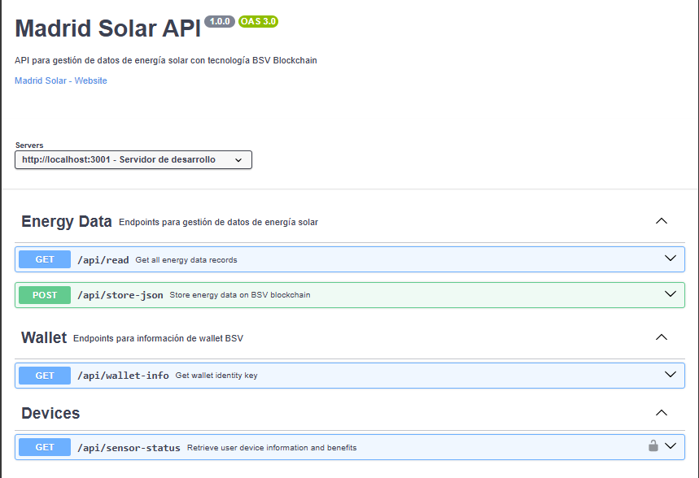
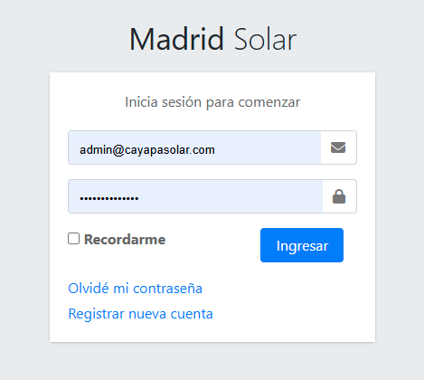
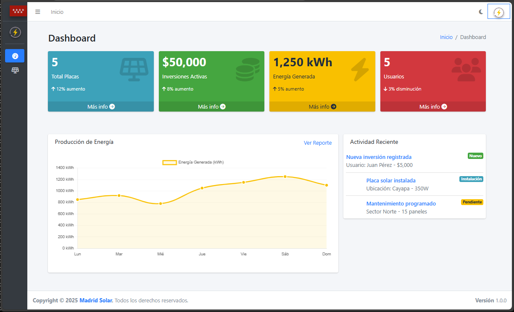
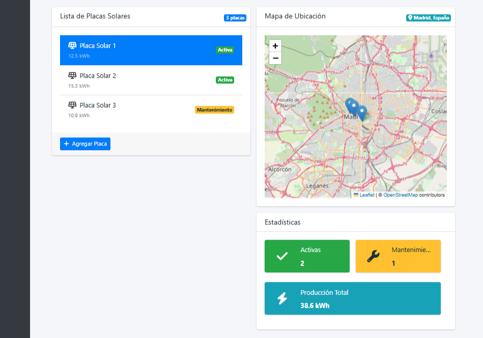
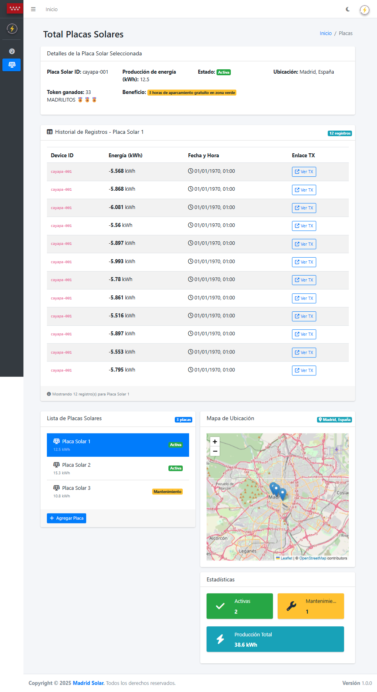
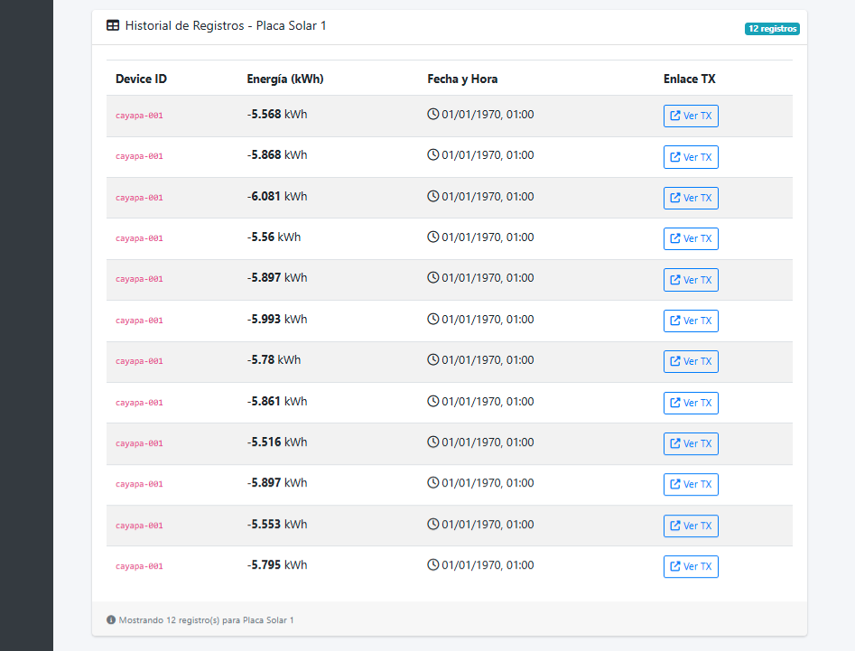

# 🌞 Cayapa Solar - MMERGE Web3 Hackathon 2025

Sistema de gestión y monitoreo de paneles solares con integración blockchain BSV.

## Características

- Dispositivo IoT que reporta directamente en la blockchain BSV.

- Backend con API para interoperar los componentes de software.

- Panel administrativo para visualizar producción de energía, gestión de inversiones y registro de transacciones en blockchain.

- Aplicacion movil para el usuario final.

---

## 📁 Estructura del Proyecto

```
cayapa-solar/
├── frontend/         # Panel administrativo React + TypeScript + AdminLTE
├── backend/          # API Next.js + BSV Blockchain integration
├── microprocessor/   # Código Arduino para placas IoT
├── mobile/           # Código mobile para iPhone
└── start-dev.sh      # Script de inicio rápido (Linux/Mac)
```

---

## 🎨 Capturas de Pantalla

### Iot Microprocessor


---

### Backend API Docs



---

### Frontend

#### Formulario de autenticación - Login



---

#### Vista principal con estadísticas



---

#### Placas - Mapa interactivo con marcadores



---

#### Placas - Panel de información de placa seleccionada



---

#### Placas - Tabla de datos de energía



---

### Mobile - iPhone


---

## 🚀 Inicio Rápido

### Opción 1: Script Automático (Linux/Mac)

```bash
# Desde la raíz del proyecto
./start-dev.sh
```

Este script:
- ✅ Verifica dependencias
- ✅ Crea archivo .env si no existe
- ✅ Inicia backend (puerto 3001)
- ✅ Inicia frontend (puerto 3000)
- ✅ Guarda logs en carpeta logs/

### Opción 2: Manual

#### Terminal 1 - Backend
```bash
cd backend
npm install
npm run dev
# Backend en http://localhost:3001
```

#### Terminal 2 - Frontend
```bash
cd frontend
npm install
npm run dev
# Frontend en http://localhost:3000
```

---

## 🏗️ Stack Tecnológico

### IoT
- **Arduino** - Código para microcontroladores de placas.

### Backend
- **Next.js** - Framework React full-stack.
- **BSV Blockchain** - Bitcoin SV para transacciones.
- **TypeScript** - Tipado en backend.
- **JSON Storage** - Almacenamiento temporal de datos.

### Frontend
- **React 18.3** - Biblioteca UI con hooks
- **TypeScript 5.5** - Tipado estático
- **Vite 5.4** - Build tool ultrarrápido
- **AdminLTE 3.2** - Template admin profesional
- **React Router 6** - Enrutamiento SPA
- **Zustand 4.5** - Gestión de estado
- **TanStack Query 5** - Server state management
- **Axios** - Cliente HTTP
- **React Leaflet 4.2** - Mapas interactivos
- **SCSS** - Preprocesador CSS

### Mobile
- **Flutter** - Código para una aplicacion movil de iPhone con Flutter.

---

## 📖 Documentación Detallada

### Microprocessor
- [README Microprocessor](./microprocessor/README.md) - codigo de IoT.

### Backend
- [README Backend](./backend/README.md) - API y endpoints.

### Frontend
- [README Frontend](./frontend/README.md) - Instalación y configuración
- [Guía de Pruebas](./frontend/TESTING.md) - Testing end-to-end
- [Resumen de Implementación](./frontend/IMPLEMENTATION_SUMMARY.md) - Detalles técnicos
- [Inicio Rápido](./frontend/QUICKSTART.md) - Guía rápida
- [Arquitectura](./frontend/ARCHITECTURE.md) - Estructura del código

### Mobile
- [README Mobile](./mobile/README.md) - aplicacion movil de iPhone con Flutter.

---

## 🌟 Funcionalidades Principales

### 1. Dashboard
- 📊 Estadísticas en tiempo real
- 📈 4 widgets principales:
  - Total Placas Solares
  - Energía Total Generada
  - Inversiones Activas
  - Usuarios Registrados

### 2. Total Placas (/placas)
- 🗺️ Mapa interactivo de Madrid con React Leaflet
- 📍 3 placas solares con marcadores
- 📋 Información detallada de cada placa:
  - ID del dispositivo
  - Ubicación
  - Capacidad (kW)
  - Estado (activa/inactiva)
- 📊 **Tabla de registros de energía:**
  - Device ID
  - Energía producida (kWh)
  - Fecha y hora
  - Enlace a transacción blockchain

### 3. Autenticación
- 🔐 Login simulado (desarrollo)
- 👤 Usuario: cualquier email válido
- 🔑 Password: cualquier contraseña
- 💾 Persistencia en localStorage

### 4. Integración Blockchain
- ⛓️ Registro de transacciones en BSV
- 🔗 Enlaces directos a blockchain explorer
- 📝 Almacenamiento inmutable de datos

---

## 🔌 API Endpoints

### Backend (http://localhost:3001)

| Método | Endpoint | Descripción | Respuesta |
|--------|----------|-------------|-----------|
| GET | `/api/read` | Obtener registros de energía | `EnergyDataStored[]` |
| POST | `/api/store-json` | Guardar datos JSON | Success |
| GET | `/api/wallet-info` | Info de wallet BSV | Wallet details |

---

## 📊 Modelos de Datos

### EnergyDataStored
```typescript
interface EnergyDataStored {
  device_id: string      // ID de la placa solar
  energy: number         // Energía en kWh
  timestamp: number      // Unix timestamp en ms
  tx_link: string        // URL a transacción blockchain
}
```

### SolarPanel
```typescript
interface SolarPanel {
  id: string            // Device ID
  name: string          // Nombre descriptivo
  location: string      // Ubicación física
  capacity: number      // Capacidad en kW
  status: 'active' | 'inactive'
  coordinates: [number, number]  // [lat, lng]
}
```

---

## 🧪 Testing

### Prueba Manual Completa

1. **Iniciar servidores** (ver sección Inicio Rápido)

2. **Test de Login:**
   ```
   URL: http://localhost:3000
   Email: cayapa@madridsolar.com
   Password: Cayapa2035
   Resultado esperado: Redirige a dashboard
   ```

3. **Test de Dashboard:**
   ```
   URL: http://localhost:3000/
   Verificar: 4 stat cards visibles
   ```

4. **Test de Placas:**
   ```
   URL: http://localhost:3000/placas
   Verificar:
   - Mapa cargado con 3 marcadores
   - Click en marcador muestra info
   - Tabla carga datos del backend
   - Filtrado por device_id funciona
   ```

5. **Test de API:**
   ```bash
   curl http://localhost:3001/api/read
   # Debe devolver array de registros de energía
   ```

### Verificar CORS

Abrir DevTools → Network → Clic en request a /api/read → Headers:
```
Access-Control-Allow-Origin: *
Access-Control-Allow-Methods: GET, OPTIONS
```

---

## 🐛 Solución de Problemas Comunes

### 1. Error: "Cannot find module"
```bash
cd frontend && npm install
cd backend && npm install
```

### 2. Error: "Port 3000 already in use"
```bash
# Encontrar proceso
lsof -i :3000
# Matar proceso
kill -9 [PID]
```

### 3. Error: "CORS policy"
- Verificar que backend tenga CORS configurado en `/api/read.ts`
- Reiniciar backend después de cambios

### 4. Tabla vacía en /placas
- Verificar que existe `backend/solar-data.json`
- Verificar que backend esté corriendo
- Abrir DevTools → Console para ver errores

### 5. Mapa no carga
- Verificar que `index.html` tenga Leaflet CSS
- Verificar conexión a internet (CDN de Leaflet)

---

## 📦 Datos de Prueba

El archivo `backend/solar-data.json` contiene:
- 8 registros de energía
- 3 placas diferentes (12345, 12346, 12347)
- Timestamps de diciembre 2024
- Enlaces a blockchain explorer

---

## 🚀 Deployment

### Frontend (Vercel/Netlify)
```bash
cd frontend
npm run build
# Carpeta dist/ lista para deploy
```

### Backend (Vercel/Railway)
```bash
cd backend
npm run build
npm start
```

### Variables de Entorno Producción

**Frontend:**
```env
VITE_API_BASE_URL=https://api.cayapa.solar/api
VITE_APP_TITLE=Cayapa Solar
VITE_BACKEND_URL=https://api.cayapa.solar
```

**Backend:**
```env
NODE_ENV=production
BSV_NETWORK=mainnet
WALLET_PRIVATE_KEY=your_key_here
```

---

## 🔗 Enlaces Útiles

- [BSV Blockchain](https://bitcoinsv.com)
- [ESP32-DevKitC](https://www.espressif.com/en/products/devkits/esp32-devkitc)
- [Next.js Documentation](https://nextjs.org/docs)
- [AdminLTE Documentation](https://adminlte.io/docs)
- [React Documentation](https://react.dev)
- [React Leaflet](https://react-leaflet.js.org)
- [Flutter Documentation](https://docs.flutter.dev/)

---

## 👥 Equipo Cayapa Solar

Proyecto desarrollado para **[MMERGE Web3 Hackathon 2025](https://www.linkedin.com/company/mmerge)**:

- [Alejandro Sanchez](https://www.linkedin.com/in/alejandrocarracedo/)
- [Álvaro Rubén Hurtado Maldonado](https://www.linkedin.com/in/alvarohurtadobo/), [@alvarohurtadobo](https://github.com/alvarohurtadobo)
- [Victor Bague](https://www.linkedin.com/in/victorbague/), [@VictorBagueUAX](https://github.com/VictorBagueUAX)
- [Manuel Jesús Rojas Villanueva](https://www.linkedin.com/in/manuelrojasvillanueva/), [@texaco](https://github.com/texaco)
- [Leonardo J. Caballero G.](https://www.linkedin.com/in/leonardojcaballerog/), [@macagua](https://github.com/macagua)


---

## 📄 Licencia

Este proyecto está bajo la licencia [MIT](./LICENSE.md).

---

**¡Desarrollemos el futuro de la energía solar con blockchain! ☀️⛓️**
