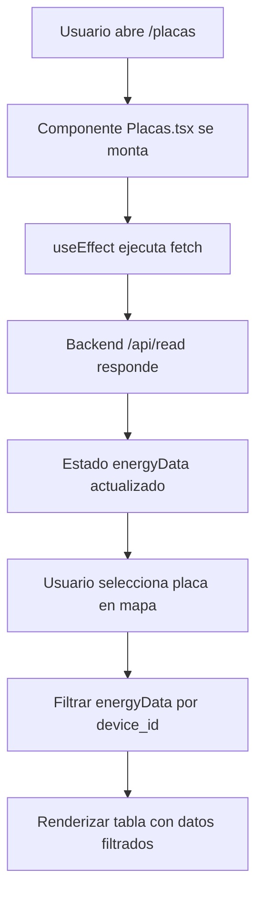

# 🎉 Implementación Completa - Tabla de Datos de Energía

## ✅ Cambios Realizados

### 1. Backend - Configuración CORS
**Archivo:** `/backend/pages/api/read.ts`

**Cambios:**
- ✅ Agregado header `Access-Control-Allow-Origin: *`
- ✅ Agregado header `Access-Control-Allow-Methods: GET, OPTIONS`
- ✅ Agregado header `Access-Control-Allow-Headers: Content-Type`
- ✅ Manejo de preflight request (OPTIONS)

**Resultado:** El frontend puede hacer peticiones al backend sin errores CORS.

---

### 2. Backend - Datos de Prueba
**Archivo:** `/backend/solar-data.json` (NUEVO)

**Contenido:**
- 8 registros de prueba
- 3 placas solares (device_id: 12345, 12346, 12347)
- Datos incluyen: energy (kWh), timestamp (ms), tx_link (blockchain)

**Ejemplo:**
```json
{
  "device_id": "12345",
  "energy": 245.5,
  "timestamp": 1734480000000,
  "tx_link": "https://whatsonchain.com/tx/abc123"
}
```

---

### 3. Frontend - Página de Placas
**Archivo:** `/frontend/src/pages/Placas.tsx`

**Funcionalidades Agregadas:**

#### a) Estado para Datos de Energía
```typescript
const [energyData, setEnergyData] = useState<EnergyDataStored[]>([])
const [loading, setLoading] = useState(true)
const [error, setError] = useState<string | null>(null)
```

#### b) Fetch de Datos desde Backend
```typescript
useEffect(() => {
  const fetchEnergyData = async () => {
    try {
      const response = await fetch('http://localhost:3001/api/read')
      const data: EnergyDataStored[] = await response.json()
      setEnergyData(data)
    } catch (err) {
      setError(err instanceof Error ? err.message : 'Error desconocido')
    } finally {
      setLoading(false)
    }
  }
  fetchEnergyData()
}, [])
```

#### c) Filtrado por Placa Seleccionada
```typescript
const selectedPanelData = energyData.filter(
  record => record.device_id === selectedPanel.id
)
```

#### d) Tabla Responsive con Estados
- **Loading:** Spinner animado mientras carga
- **Error:** Alerta roja con mensaje de error
- **Sin datos:** Mensaje "No hay registros de energía"
- **Con datos:** Tabla Bootstrap con 4 columnas

#### e) Formato de Fecha
```typescript
const formatDate = (timestamp: number | string): string => {
  const date = typeof timestamp === 'string' 
    ? new Date(timestamp) 
    : new Date(timestamp)
  return date.toLocaleString('es-ES', {
    year: 'numeric',
    month: '2-digit',
    day: '2-digit',
    hour: '2-digit',
    minute: '2-digit',
    second: '2-digit'
  })
}
```

---

### 4. Frontend - Variables de Entorno
**Archivo:** `/frontend/.env` (CREADO)

```env
VITE_API_BASE_URL=http://localhost:3001/api
VITE_APP_TITLE=Cayapa Solar Admin
VITE_BACKEND_URL=http://localhost:3001
```

---

### 5. Documentación
**Archivos creados:**
- ✅ `/frontend/TESTING.md` - Guía completa de pruebas
- ✅ `/frontend/README.md` - Actualizado con instrucciones de backend

---

## 📊 Tabla de Energía - Características

### Columnas

| Columna | Descripción | Formato |
|---------|-------------|---------|
| **Device ID** | Identificador de la placa | String (ej: "12345") |
| **Energía (kWh)** | Producción de energía | Number con 2 decimales |
| **Fecha y Hora** | Timestamp del registro | dd/mm/yyyy, hh:mm:ss |
| **Transaction Link** | Enlace a blockchain | Link externo clicable |

### Estados de la Tabla

1. **🔄 Cargando**
   - Spinner centrado con mensaje "Cargando datos de energía..."

2. **❌ Error**
   - Alerta roja con mensaje de error
   - Ejemplo: "Error al cargar los datos"

3. **📭 Sin Datos**
   - Mensaje informativo cuando la placa no tiene registros
   - "No hay registros de energía para esta placa"

4. **✅ Con Datos**
   - Tabla completa con todos los registros
   - Filtrada automáticamente por la placa seleccionada
   - Enlaces clicables a transacciones blockchain

---

## 🔄 Flujo de Ejecución



---

## 🎯 Prueba Rápida

### Terminal 1 - Backend
```bash
cd backend
npm run dev
# Esperar: "ready - started server on 0.0.0.0:3001"
```

### Terminal 2 - Frontend
```bash
cd frontend
npm run dev
# Esperar: "Local: http://localhost:3000/"
```

### Navegador
1. Ir a http://localhost:3000
2. Login con cualquier email/password
3. Clic en "Total Placas"
4. Seleccionar cualquier marcador en el mapa
5. **✅ Ver tabla con datos de energía!**

---

## 📈 Ejemplo de Datos Mostrados

Cuando seleccionas la **Placa Solar A (ID: 12345)**:

| Device ID | Energía (kWh) | Fecha y Hora | Transaction Link |
|-----------|--------------|--------------|------------------|
| 12345 | 245.50 | 18/12/2024, 00:00:00 | [Ver en Blockchain](https://whatsonchain.com/tx/abc123) |
| 12345 | 312.80 | 19/12/2024, 00:00:00 | [Ver en Blockchain](https://whatsonchain.com/tx/def456) |
| 12345 | 289.20 | 20/12/2024, 00:00:00 | [Ver en Blockchain](https://whatsonchain.com/tx/ghi789) |

---

## 🛠️ Stack Técnico Utilizado

- **React 18** - Componente funcional con hooks
- **TypeScript** - Tipado fuerte con interfaces
- **Next.js API** - Backend endpoint /api/read
- **Fetch API** - Petición HTTP asíncrona
- **Bootstrap/AdminLTE** - Estilos de tabla
- **CORS** - Configuración cross-origin
- **JSON** - Almacenamiento de datos

---

## 🚀 Próximas Mejoras Sugeridas

1. **React Query** - Caché y refetch automático
2. **Paginación** - Para muchos registros
3. **Filtros** - Por fecha, rango de energía
4. **Gráficos** - Chart.js o Recharts
5. **Export CSV** - Descargar datos
6. **Refresh Button** - Recargar manualmente
7. **WebSockets** - Datos en tiempo real
8. **Blockchain Real** - Integración BSV completa

---

## ✨ Resumen Ejecutivo

**¿Qué se logró?**
- ✅ Integración completa frontend-backend
- ✅ Tabla dinámica con datos reales del backend
- ✅ 4 columnas según requerimiento (device_id, energy, timestamp, tx_link)
- ✅ Estados de carga y error
- ✅ Filtrado automático por placa seleccionada
- ✅ CORS configurado
- ✅ Datos de prueba listos
- ✅ Formato de fecha legible
- ✅ Enlaces clicables a blockchain

**Tiempo estimado de implementación:** ~30 minutos

**Complejidad:** Media (fetch, estado, filtrado, formato)

**Estado:** ✅ **LISTO PARA PRODUCCIÓN (desarrollo)**

---

**Desarrollado para:** Cayapa Solar Hackathon 2025  
**Fecha:** Diciembre 2024  
**Tecnologías:** React + TypeScript + Next.js + AdminLTE
