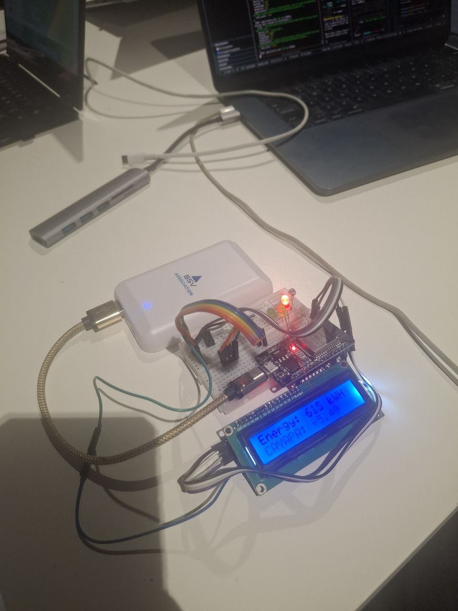

# Microprocessor - ESP32 Solar Panel Monitor

Este directorio contiene el firmware para el microcontrolador ESP32 que monitorea y reporta datos de energía solar del proyecto Cayapa Solar.

## 📋 Descripción

El firmware `cayapa.ino` permite al ESP32:
- Leer valores de un sensor conectado al ADC (convertidor analógico-digital)
- Convertir lecturas ADC a valores de energía en kWh (rango: -10 a 20)
- Mostrar datos en tiempo real en una pantalla LCD I2C
- Indicar rangos de energía mediante LEDs
- Enviar datos al servidor backend vía WiFi cada 5 segundos

---

## 🎨 Capturas de Pantalla

### Iot Microprocessor



---

## 🔧 Hardware Requerido

- **Microcontrolador**: ESP32 DevKit
- **Display**: LCD 16x2 con módulo I2C (dirección 0x27 o 0x3F)
- **LEDs**: 3 LEDs indicadores con resistencias (220Ω recomendado)
- **Sensor**: Sensor analógico de energía solar
- **Cables**: Jumpers y cable USB para programación

### Conexiones de Pines

| Componente | Pin ESP32 | Descripción |
|------------|-----------|-------------|
| Sensor ADC | GPIO 36 (ADC0) | Entrada analógica del sensor |
| LED Negativo | GPIO 32 | Indicador energía negativa (< 0 kWh) |
| LED 0-10 | GPIO 33 | Indicador rango 0-10 kWh |
| LED 10-20 | GPIO 26 | Indicador rango 10-20 kWh |
| LCD SDA | GPIO 21 | Comunicación I2C |
| LCD SCL | GPIO 22 | Comunicación I2C |
| LCD VCC | 5V o 3.3V | Alimentación |
| LCD GND | GND | Tierra |

---

## 📦 Librerías Necesarias

Instala las siguientes librerías desde el Administrador de Librerías de Arduino IDE:

```
- WiFi (incluida con ESP32)
- HTTPClient (incluida con ESP32)
- LiquidCrystal_I2C (by Frank de Brabander)
- ArduinoJson (by Benoit Blanchon) - versión 6.x
```

---

## ⚙️ Configuración

### 1. Credenciales WiFi

Edita las siguientes líneas en `cayapa.ino`:

```cpp
const char* ssid = "TU_SSID";          // Nombre de tu red WiFi
const char* password = "TU_PASSWORD";   // Contraseña de tu red WiFi
```

### 2. Dirección del Servidor

Configura la IP de tu servidor backend:

```cpp
const char* serverURL = "http://192.168.1.XXX:3001/api/store-json";
```

**Cómo encontrar la IP del servidor:**
- Windows: Ejecuta `ipconfig` en CMD
- Linux/Mac: Ejecuta `ifconfig` o `ip addr` en terminal
- Busca la dirección IPv4 de tu red local (generalmente 192.168.x.x)

### 3. Dirección I2C del LCD

Si el LCD no funciona, prueba cambiar la dirección:

```cpp
LiquidCrystal_I2C lcd(0x3F, 16, 2);  // Cambia 0x27 por 0x3F si es necesario
```

**Detectar dirección I2C:**
Usa el sketch `I2C Scanner` disponible en: Archivo > Ejemplos > Wire > i2c_scanner

---

## 🚀 Instalación y Uso

### 1. Preparar Arduino IDE

1. Instala [Arduino IDE](https://www.arduino.cc/en/software) (versión 2.x recomendada)
2. Agrega soporte para ESP32:
   - Archivo > Preferencias
   - En "Gestor de URLs adicionales", agrega:
     ```
     https://raw.githubusercontent.com/espressif/arduino-esp32/gh-pages/package_esp32_index.json
     ```
   - Herramientas > Placa > Gestor de tarjetas
   - Busca "ESP32" e instala "esp32 by Espressif Systems"

### 2. Cargar el Firmware

1. Conecta el ESP32 a tu computadora vía USB
2. Abre `cayapa.ino` en Arduino IDE
3. Selecciona la placa:
   - Herramientas > Placa > ESP32 Arduino > ESP32 Dev Module
4. Selecciona el puerto:
   - Herramientas > Puerto > (selecciona el puerto COM/ttyUSB del ESP32)
5. Configura WiFi y servidor (ver sección Configuración)
6. Haz clic en "Subir" (→)

### 3. Monitor Serial

Abre el Monitor Serial (Ctrl+Shift+M) a 115200 baudios para ver:
- Estado de conexión WiFi
- IP asignada al ESP32
- Lecturas del sensor
- Respuestas del servidor
- Mensajes de error

---

## 📊 Funcionamiento

### Lectura de Energía

```
ADC (0-4095) → Energy (-10 a 20 kWh)
Formula: energy = -10 + (adcValue / 4095.0) * 30
```

### Indicadores LED

| Rango de Energía | LED Encendido | Pin |
|------------------|---------------|-----|
| < 0 kWh | LED Negativo (rojo) | GPIO 32 |
| 0-10 kWh | LED 0-10 (amarillo) | GPIO 33 |
| 10-20 kWh | LED 10-20 (verde) | GPIO 26 |

### Display LCD

**Línea 1**: `Energy: [ADC] kWH`  
**Línea 2**: `CAYAPA: [valor]`

Ejemplo:
```
Energy: 2048 kWH
CAYAPA: 5.00
```

### Comunicación con Backend

El ESP32 envía datos JSON al servidor cada 5 segundos:

```json
{
  "device_id": "cayapa-001",
  "energy": 5.23,
  "timestamp": 1234567
}
```

**Endpoint**: `POST /api/store-json`  
**Content-Type**: `application/json`

---

## 🐛 Solución de Problemas

### WiFi no conecta

- Verifica SSID y contraseña
- Asegúrate de usar red 2.4GHz (ESP32 no soporta 5GHz)
- Revisa que el router esté encendido

### LCD en blanco

- Ajusta el potenciómetro de contraste en el módulo I2C
- Verifica la dirección I2C (0x27 o 0x3F)
- Comprueba conexiones SDA/SCL

### Error de conexión al servidor (código -1)

```
Error en POST: -1 - Error de conexión
```

**Soluciones:**
1. Verifica que la IP del servidor sea correcta
2. Asegura que el backend esté corriendo en puerto 3001
3. Confirma que ESP32 y servidor estén en la misma red local
4. Desactiva firewall temporalmente para pruebas

### LEDs no encienden

- Verifica polaridad de los LEDs (ánodo a GPIO, cátodo a GND con resistencia)
- Usa resistencias de 220Ω-330Ω para proteger los LEDs
- Comprueba que los pines GPIO estén correctos

### Lecturas ADC erráticas

- Agrega un capacitor (10-100nF) entre pin ADC y GND
- Asegura buenas conexiones sin cables largos
- Calibra el sensor según especificaciones del fabricante

---

## 📡 Integración con Backend

Este firmware se integra con el backend Next.js del proyecto:

- **Endpoint**: `/api/store-json` en `backend/pages/api/store-json.ts`
- **Formato de datos**: JSON con device_id, energy, timestamp
- **Almacenamiento**: Los datos se guardan en `backend/solar-data.json`
- **Lectura**: Frontend consume datos desde `/api/read`

---

## 🔄 Flujo de Datos

```
Sensor → ADC ESP32 → Procesamiento → LCD/LEDs
                  ↓
              WiFi POST
                  ↓
         Backend API (Next.js)
                  ↓
         solar-data.json
                  ↓
      Frontend React (Dashboard)
```

## 📝 Notas de Desarrollo

- **Intervalo de envío**: 5000ms (5 segundos) - ajustable en `requestInterval`
- **Device ID**: `cayapa-001` - puedes cambiar para múltiples dispositivos
- **Resolución ADC**: 12 bits (0-4095)
- **Timeout HTTP**: Configurado por defecto en HTTPClient
- **Reconexión WiFi**: Automática si se pierde la conexión

---

## 🔐 Seguridad

**⚠️ IMPORTANTE**: Este código es para desarrollo/prototipo. Para producción:

- No incluyas credenciales WiFi en el código fuente
- Implementa autenticación en el endpoint del servidor
- Usa HTTPS en lugar de HTTP
- Implementa rate limiting en el backend
- Considera usar MQTT para comunicación más eficiente

---

## 📄 Licencia

Este código es parte del proyecto Cayapa Solar. Consulta el archivo LICENSE en la raíz del proyecto.

---

## 🤝 Contribuciones

Para reportar bugs o sugerir mejoras al firmware:

1. Abre un issue en el repositorio
2. Describe el problema con detalles (modelo de sensor, versión ESP32, logs del monitor serial)
3. Adjunta fotos del circuito si es problema de hardware

## 📚 Referencias

- [Documentación ESP32](https://docs.espressif.com/projects/esp-idf/en/latest/esp32/)
- [Arduino-ESP32 GitHub](https://github.com/espressif/arduino-esp32)
- [LiquidCrystal_I2C Library](https://github.com/johnrickman/LiquidCrystal_I2C)
- [ArduinoJson Documentation](https://arduinojson.org/)

---

## 👥 Equipo Cayapa Solar

Proyecto desarrollado para **Hackathon 2025 - M Merge**

- [Alejandro Sanchez](https://www.linkedin.com/in/alejandrocarracedo/)
- [Álvaro Rubén Hurtado Maldonado](https://www.linkedin.com/in/alvarohurtadobo/), [@alvarohurtadobo](https://github.com/alvarohurtadobo)
- [Victor Bague](https://www.linkedin.com/in/victorbague/), [@VictorBagueUAX](https://github.com/VictorBagueUAX)
- [Manuel Jesús Rojas Villanueva](https://www.linkedin.com/in/manuelrojasvillanueva/), [@texaco](https://github.com/texaco)
- [Leonardo J. Caballero G.](https://www.linkedin.com/in/leonardojcaballerog/), [@macagua](https://github.com/macagua)


---

## 📄 Licencia

Este proyecto está bajo la licencia [MIT](./LICENSE.md).
