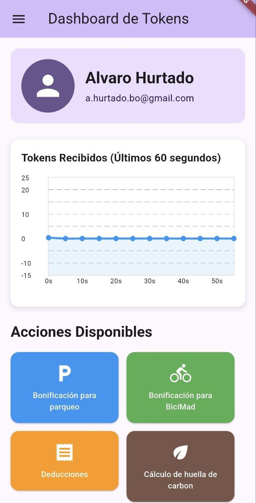

# Cayapa Solar - Aplicación Móvil

Aplicación móvil multiplataforma construida con Flutter para la gamificación y gestión de tokens de energía solar.

## 🚀 Características

- 📱 **Flutter** - Framework multiplataforma (iOS, Android, Web, Windows, macOS, Linux)
- 📊 **Gráficas en tiempo real** - Visualización de tokens con FL Chart
- 🔄 **Actualización automática** - Polling cada 2.5 segundos
- 🎨 **Material Design 3** - UI moderna y responsive
- 🌐 **Integración API REST** - Conexión con backend Next.js
- 🎮 **Gamificación** - Sistema de recompensas y bonificaciones

---

## 🎨 Capturas de Pantalla

### Mobile - iPhone



## 📁 Estructura del Proyecto

```
mobile/
├── lib/
│   └── main.dart           # Aplicación principal (496 líneas)
├── android/                # Configuración Android
├── ios/                    # Configuración iOS
├── web/                    # Configuración Web
├── windows/                # Configuración Windows
├── macos/                  # Configuración macOS
├── linux/                  # Configuración Linux
├── assets/                 # Recursos estáticos
├── pubspec.yaml           # Dependencias y configuración
└── README.md              # Esta documentación
```

## 🛠️ Instalación

### Prerrequisitos

- **Flutter SDK** >= 3.9.2
- **Dart SDK** incluido con Flutter
- **Backend de Cayapa Solar** ejecutándose en `http://localhost:3001`

### Pasos de instalación

1. **Instalar Flutter:**

   Sigue la [guía oficial de instalación](https://docs.flutter.dev/get-started/install) según tu sistema operativo.

2. **Verificar instalación:**

   ```bash
   flutter doctor
   ```

3. **Instalar dependencias:**

   ```bash
   cd mobile
   flutter pub get
   ```

4. **Configurar emulador/dispositivo:**

   - **Android**: Abre Android Studio y configura un AVD
   - **iOS**: Abre Xcode y configura un simulador (solo macOS)
   - **Web**: No requiere configuración adicional

5. **Iniciar backend (en otra terminal):**

   ```bash
   cd ../backend
   npm run dev
   # Backend debe estar en http://localhost:3001
   ```

6. **Ejecutar aplicación:**

   ```bash
   # Android/iOS (requiere emulador o dispositivo conectado)
   flutter run

   # Web (recomendado para desarrollo)
   flutter run -d chrome

   # Windows (solo en Windows)
   flutter run -d windows

   # macOS (solo en macOS)
   flutter run -d macos

   # Linux (solo en Linux)
   flutter run -d linux
   ```

## 📦 Dependencias

### Principales

```yaml
dependencies:
  flutter:
    sdk: flutter
  cupertino_icons: ^1.0.8    # Iconos iOS
  fl_chart: ^0.69.0          # Gráficas y visualizaciones
  http: ^1.1.0               # Cliente HTTP para API REST
```

### Desarrollo

```yaml
dev_dependencies:
  flutter_test:
    sdk: flutter
  flutter_lints: ^5.0.0      # Linter y análisis de código
  flutter_launcher_icons: ^0.13.1  # Generador de iconos
```

## 📱 Aplicación Principal

### `/lib/main.dart` - Código Fuente Completo

**Archivo único:** 496 líneas con toda la funcionalidad de la app.

#### **1. Configuración de la Aplicación**

```dart
void main() {
  runApp(const MyApp());
}

class MyApp extends StatelessWidget {
  @override
  Widget build(BuildContext context) {
    return MaterialApp(
      title: 'Cayapa Solar',
      theme: ThemeData(
        colorScheme: ColorScheme.fromSeed(seedColor: Colors.deepPurple),
        useMaterial3: true,
      ),
      home: const GamificationDashboard(),
    );
  }
}
```

**Características:**
- Material Design 3 (useMaterial3: true)
- Tema basado en color púrpura profundo
- Punto de entrada único: `GamificationDashboard`

---

#### **2. Estado de la Aplicación**

```dart
class _GamificationDashboardState extends State<GamificationDashboard> {
  List<FlSpot> tokenData = [];       // Datos de la gráfica (12 puntos)
  Timer? _timer;                     // Timer para polling
  bool _isLoading = false;           // Estado de carga
  String? _errorMessage;             // Mensaje de error
  final String apiUrl = 'http://localhost:3001/api/read';
}
```

**Variables de estado:**
- **tokenData**: Lista de puntos para gráfica FL Chart (últimos 60 segundos)
- **_timer**: Timer.periodic para actualización cada 2.5 segundos
- **_isLoading**: Evita peticiones simultáneas
- **_errorMessage**: Muestra errores de conexión/API
- **apiUrl**: Endpoint del backend Next.js

---

#### **3. Ciclo de Vida y Polling**

```dart
@override
void initState() {
  super.initState();
  _fetchEnergyData();  // Carga inicial
  _timer = Timer.periodic(
    const Duration(milliseconds: 2500),
    (timer) => _fetchEnergyData()
  );
}

@override
void dispose() {
  _timer?.cancel();  // Limpieza de recursos
  super.dispose();
}
```

**Características:**
- **initState**: Carga datos iniciales + inicia polling
- **Polling**: Actualización automática cada 2.5 segundos
- **dispose**: Cancela timer para evitar memory leaks

---

#### **4. Fetch de Datos de Energía**

```dart
Future<void> _fetchEnergyData() async {
  if (_isLoading) return;  // Evitar peticiones simultáneas

  setState(() {
    _isLoading = true;
    _errorMessage = null;
  });

  try {
    final response = await http.get(
      Uri.parse(apiUrl),
      headers: {'accept': 'application/json'},
    ).timeout(const Duration(seconds: 5));

    if (response.statusCode == 200) {
      final List<dynamic> data = json.decode(response.body);
      
      // Extraer valores de energía y convertir a tokens
      List<double> energyValues = data
          .map((item) => (item['energy'] as num?)?.toDouble() ?? 0.0)
          .toList();

      // Convertir energía negativa a valores positivos (tokens)
      List<double> tokenValues = energyValues
          .map((energy) => energy.abs())
          .toList();

      // Tomar solo los últimos 12 valores
      if (tokenValues.length > 12) {
        tokenValues = tokenValues.sublist(tokenValues.length - 12);
      }

      // Rellenar con ceros si hay menos de 12 valores
      while (tokenValues.length < 12) {
        tokenValues.insert(0, 0.0);
      }

      // Crear puntos para FL Chart
      setState(() {
        tokenData = tokenValues.asMap().entries.map((entry) {
          return FlSpot(entry.key.toDouble(), entry.value);
        }).toList();
        _isLoading = false;
      });
    }
  } catch (e) {
    setState(() {
      _errorMessage = 'Error de conexión: ${e.toString()}';
      _isLoading = false;
    });
  }
}
```

**Lógica:**
1. Previene peticiones simultáneas con flag `_isLoading`
2. Timeout de 5 segundos para evitar bloqueos
3. Extrae valores de `energy` del JSON
4. Convierte energía a tokens (valores absolutos)
5. Mantiene exactamente 12 puntos (rellena con ceros o recorta)
6. Crea `FlSpot` para la gráfica (x: índice, y: tokens)
7. Maneja errores de red/API

---

#### **5. Interfaz de Usuario**

**Layout principal:**

```dart
@override
Widget build(BuildContext context) {
  return Scaffold(
    appBar: AppBar(
      title: const Text('Dashboard de Tokens'),
      backgroundColor: Theme.of(context).colorScheme.inversePrimary,
    ),
    drawer: _buildDrawer(),
    body: SingleChildScrollView(
      padding: const EdgeInsets.all(16.0),
      child: Column(
        crossAxisAlignment: CrossAxisAlignment.start,
        children: [
          _buildUserHeader(),        // Header con info de usuario
          const SizedBox(height: 24),
          _buildTokenChart(),        // Gráfica de tokens
          const SizedBox(height: 24),
          _buildActionButtons(),     // Botones de acciones
        ],
      ),
    ),
  );
}
```

---

#### **6. Header de Usuario**

```dart
Widget _buildUserHeader() {
  return Container(
    padding: const EdgeInsets.all(16.0),
    decoration: BoxDecoration(
      color: Theme.of(context).colorScheme.primaryContainer,
      borderRadius: BorderRadius.circular(12),
    ),
    child: Row(
      children: [
        CircleAvatar(
          radius: 40,
          backgroundColor: Theme.of(context).colorScheme.primary,
          child: const Icon(Icons.person, size: 50, color: Colors.white),
        ),
        const SizedBox(width: 16),
        Expanded(
          child: Column(
            crossAxisAlignment: CrossAxisAlignment.start,
            children: [
              Text('Alvaro Hurtado',
                style: Theme.of(context).textTheme.headlineSmall?.copyWith(
                  fontWeight: FontWeight.bold,
                ),
              ),
              const SizedBox(height: 4),
              Text('a.hurtado.bo@gmail.com',
                style: Theme.of(context).textTheme.bodyMedium?.copyWith(
                  color: Theme.of(context).colorScheme.onPrimaryContainer,
                ),
              ),
            ],
          ),
        ),
      ],
    ),
  );
}
```

**Características:**
- Avatar circular con ícono de persona
- Nombre de usuario (hardcodeado: "Alvaro Hurtado")
- Email (hardcodeado: "a.hurtado.bo@gmail.com")
- Fondo con color del tema
- Bordes redondeados (12px)

---

#### **7. Gráfica de Tokens (FL Chart)**

```dart
Widget _buildTokenChart() {
  // Calcular máximo dinámicamente
  double maxY = 10;
  if (tokenData.isNotEmpty) {
    maxY = tokenData.map((spot) => spot.y).reduce((a, b) => a > b ? a : b);
    maxY = maxY > 0 ? (maxY * 1.2).ceilToDouble() : 10;
  }

  return Container(
    height: 250,
    decoration: BoxDecoration(
      color: Colors.white,
      borderRadius: BorderRadius.circular(12),
      boxShadow: [
        BoxShadow(
          color: Colors.grey.withOpacity(0.2),
          spreadRadius: 2,
          blurRadius: 5,
          offset: const Offset(0, 3),
        ),
      ],
    ),
    child: LineChart(
      LineChartData(
        gridData: FlGridData(
          show: true,
          drawVerticalLine: false,
          horizontalInterval: maxY / 5,
        ),
        titlesData: FlTitlesData(
          leftTitles: AxisTitles(
            sideTitles: SideTitles(
              showTitles: true,
              reservedSize: 40,
              getTitlesWidget: (value, meta) {
                return Text(value.toStringAsFixed(1));
              },
            ),
          ),
          bottomTitles: AxisTitles(
            sideTitles: SideTitles(
              showTitles: true,
              reservedSize: 30,
              getTitlesWidget: (value, meta) {
                if (value.toInt() % 2 == 0) {
                  return Text('${value.toInt() * 5}s');
                }
                return const Text('');
              },
            ),
          ),
        ),
        lineBarsData: [
          LineChartBarData(
            spots: tokenData,
            isCurved: true,              // Línea curva
            color: Colors.blue,          // Color azul
            barWidth: 3,                 // Grosor de línea
            dotData: const FlDotData(show: true),
            belowBarData: BarAreaData(
              show: true,
              color: Colors.blue.withOpacity(0.1),
            ),
          ),
        ],
        minX: 0,
        maxX: 11,
        minY: 0,
        maxY: maxY,
      ),
    ),
  );
}
```

**Características:**
- **Altura fija**: 250px
- **Eje Y dinámico**: Ajusta automáticamente según datos (maxY * 1.2)
- **Eje X**: 12 puntos (0-11) representando últimos 60 segundos
- **Labels X**: Cada 2 puntos (0s, 10s, 20s, 30s, 40s, 50s)
- **Línea curva**: Transiciones suaves entre puntos
- **Área rellena**: Azul con 10% opacidad
- **Grid horizontal**: 5 divisiones
- **Sombra**: Efecto de elevación

---

#### **8. Botones de Acciones**

```dart
Widget _buildActionButtons() {
  final buttons = [
    {
      'title': 'Bonificación para parqueo',
      'color': Colors.blue,
      'icon': Icons.local_parking,
    },
    {
      'title': 'Bonificación para BiciMad',
      'color': Colors.green,
      'icon': Icons.directions_bike,
    },
    {
      'title': 'Deducciones',
      'color': Colors.orange,
      'icon': Icons.receipt,
    },
    {
      'title': 'Cálculo de huella de carbon',
      'color': Colors.brown,
      'icon': Icons.eco,
    },
    {
      'title': 'Historial de consumo energético',
      'color': Colors.purple,
      'icon': Icons.history,
    },
    {
      'title': 'Transacciones',
      'color': Colors.red,
      'icon': Icons.account_balance_wallet,
    },
  ];

  return Wrap(
    spacing: 12,
    runSpacing: 12,
    children: buttons.map((button) {
      return SizedBox(
        width: (MediaQuery.of(context).size.width - 48) / 2 - 6,
        child: ElevatedButton(
          onPressed: () {
            // Funcionalidad no implementada (placeholder)
          },
          style: ElevatedButton.styleFrom(
            backgroundColor: button['color'] as Color,
            foregroundColor: Colors.white,
            padding: const EdgeInsets.symmetric(vertical: 16, horizontal: 12),
            shape: RoundedRectangleBorder(
              borderRadius: BorderRadius.circular(12),
            ),
          ),
          child: Column(
            mainAxisSize: MainAxisSize.min,
            children: [
              Icon(button['icon'] as IconData, size: 32),
              const SizedBox(height: 8),
              Text(
                button['title'] as String,
                textAlign: TextAlign.center,
                style: const TextStyle(fontSize: 12),
              ),
            ],
          ),
        ),
      );
    }).toList(),
  );
}
```

**Botones disponibles:**

1. 🅿️ **Bonificación para parqueo** (Azul)
2. 🚲 **Bonificación para BiciMad** (Verde)
3. 🧾 **Deducciones** (Naranja)
4. 🌱 **Cálculo de huella de carbono** (Café)
5. 📊 **Historial de consumo energético** (Púrpura)
6. 💰 **Transacciones** (Rojo)

**Características:**
- Grid 2 columnas responsive
- Iconos Material Design 32px
- Bordes redondeados 12px
- Espaciado 12px entre botones
- **Estado**: Placeholders sin funcionalidad (preparados para futuro)

---

#### **9. Drawer de Navegación**

```dart
Widget _buildDrawer() {
  return Drawer(
    child: ListView(
      padding: EdgeInsets.zero,
      children: [
        DrawerHeader(
          decoration: BoxDecoration(
            color: Theme.of(context).colorScheme.primaryContainer,
          ),
          child: Column(
            crossAxisAlignment: CrossAxisAlignment.start,
            mainAxisAlignment: MainAxisAlignment.end,
            children: [
              CircleAvatar(
                radius: 30,
                child: const Icon(Icons.person, size: 40),
              ),
              const SizedBox(height: 12),
              Text('Alvaro Hurtado',
                style: Theme.of(context).textTheme.titleLarge?.copyWith(
                  fontWeight: FontWeight.bold,
                ),
              ),
              Text('a.hurtado.bo@gmail.com'),
            ],
          ),
        ),
        ListTile(
          leading: const Icon(Icons.home),
          title: const Text('Home'),
          onTap: () => Navigator.pop(context),
        ),
        ListTile(
          leading: const Icon(Icons.person),
          title: const Text('Perfil'),
          onTap: () => Navigator.pop(context),
        ),
        ListTile(
          leading: const Icon(Icons.info),
          title: const Text('Acerca de'),
          onTap: () => Navigator.pop(context),
        ),
        ListTile(
          leading: const Icon(Icons.notifications),
          title: const Text('Notificaciones'),
          onTap: () => Navigator.pop(context),
        ),
        ListTile(
          leading: const Icon(Icons.web),
          title: const Text('Web 3.0'),
          onTap: () => Navigator.pop(context),
        ),
        const Divider(),
        ListTile(
          leading: const Icon(Icons.exit_to_app),
          title: const Text('Salir'),
          onTap: () => Navigator.pop(context),
        ),
      ],
    ),
  );
}
```

**Opciones del menú:**
- 🏠 **Home**: Página principal
- 👤 **Perfil**: Información de usuario
- ℹ️ **Acerca de**: Información de la app
- 🔔 **Notificaciones**: Alertas y avisos
- 🌐 **Web 3.0**: Integración blockchain
- 🚪 **Salir**: Cerrar sesión

**Estado:** Todas las opciones cierran el drawer sin funcionalidad adicional.

---

## 🎨 Características de la UI

### Material Design 3
- **Theme**: Color primario púrpura profundo
- **Typography**: Sistema de texto Material 3
- **Elevation**: Sombras y efectos de profundidad
- **Shapes**: Bordes redondeados consistentes (12px)

### Responsive Design
- **Botones**: Grid 2 columnas que se adapta al ancho de pantalla
- **ScrollView**: Scroll vertical para contenido largo
- **Padding**: 16px consistente en toda la app

### Colores
- **Primario**: Púrpura profundo
- **Secundarios**: Azul, verde, naranja, café, púrpura, rojo (botones)
- **Fondo**: Blanco con sombras sutiles
- **Texto**: Negro/gris según contexto

---

## 📊 Flujo de Datos

### 1. Inicialización
```
App Start → initState() → _fetchEnergyData()
```

### 2. Polling (cada 2.5s)
```
Timer.periodic → _fetchEnergyData() → HTTP GET /api/read
```

### 3. Procesamiento
```
JSON Response → Extract energy values → Convert to tokens (abs)
→ Take last 12 values → Create FlSpot list → setState()
```

### 4. Renderizado
```
setState() → Widget rebuild → LineChart update → UI refresh
```

---

## 🔧 Configuración del Backend

La app espera el siguiente formato de respuesta del backend:

**Endpoint:** `GET http://localhost:3001/api/read`

**Response (JSON):**
```json
[
  {
    "device_id": "cayapa-001",
    "energy": -12.5,
    "timestamp": 1701436800000,
    "tx_link": "https://whatsonchain.com/tx/..."
  },
  {
    "device_id": "cayapa-001",
    "energy": -15.3,
    "timestamp": 1701436805000,
    "tx_link": "https://whatsonchain.com/tx/..."
  }
]
```

**Campos utilizados:**
- `energy`: Convertido a tokens (valor absoluto)
- Otros campos ignorados por ahora

---

## 📜 Scripts Disponibles

```bash
# Obtener dependencias
flutter pub get

# Ejecutar en desarrollo
flutter run

# Ejecutar en Web
flutter run -d chrome

# Build para producción
flutter build apk          # Android APK
flutter build ios          # iOS (solo macOS)
flutter build web          # Web
flutter build windows      # Windows (solo Windows)
flutter build macos        # macOS (solo macOS)
flutter build linux        # Linux (solo Linux)

# Limpiar build cache
flutter clean

# Verificar problemas
flutter doctor

# Analizar código
flutter analyze

# Ejecutar tests
flutter test
```

---

## 🚀 Plataformas Soportadas

| Plataforma | Estado | Notas |
|------------|--------|-------|
| **Android** | ✅ Soportado | Requiere Android Studio + AVD |
| **iOS** | ✅ Soportado | Requiere Xcode + macOS |
| **Web** | ✅ Soportado | Recomendado para desarrollo |
| **Windows** | ✅ Soportado | Solo en Windows |
| **macOS** | ✅ Soportado | Solo en macOS |
| **Linux** | ✅ Soportado | Solo en Linux |

---

## 🎯 Características Implementadas

### ✅ Funcionales
- [x] Conexión con API REST backend
- [x] Polling automático cada 2.5 segundos
- [x] Gráfica de tokens en tiempo real
- [x] Conversión de energía a tokens
- [x] Header de usuario
- [x] Drawer de navegación
- [x] Botones de acciones (UI)
- [x] Manejo de errores de red
- [x] Loading states

### 🔵 Preparadas (UI sin funcionalidad)
- [ ] Bonificación para parqueo
- [ ] Bonificación para BiciMad
- [ ] Deducciones fiscales
- [ ] Cálculo de huella de carbono
- [ ] Historial de consumo
- [ ] Transacciones blockchain
- [ ] Navegación del drawer
- [ ] Perfil de usuario
- [ ] Notificaciones
- [ ] Integración Web 3.0

---

## 🐛 Troubleshooting

### Backend no responde
```
Error de conexión: SocketException: Connection refused
```
**Solución:** Verifica que el backend esté corriendo en `http://localhost:3001`

### Gráfica vacía
```
"Cargando datos..." permanece
```
**Solución:** 
1. Verifica endpoint `/api/read` en Postman/cURL
2. Revisa formato de respuesta JSON
3. Comprueba que haya datos de energía

### Flutter doctor issues
```
[!] Android toolchain - develop for Android devices
```
**Solución:** Instala Android Studio y acepta licencias SDK:
```bash
flutter doctor --android-licenses
```

### Hot reload no funciona
```bash
# Reinicia la app
r

# Hot restart
R

# Detiene y reinicia
flutter run
```

---

## 🔐 Seguridad

### Implementado
- ✅ Timeout de 5 segundos en peticiones HTTP
- ✅ Headers de aceptación JSON
- ✅ Manejo de errores de red

### Recomendado para producción
- 🔵 HTTPS en lugar de HTTP
- 🔵 Autenticación JWT/OAuth
- 🔵 Rate limiting en cliente
- 🔵 Validación de datos del servidor
- 🔵 Cifrado de datos sensibles
- 🔵 Certificate pinning

---

## 📱 Próximas Funcionalidades

### Corto plazo (Q1 2026)
1. Implementar funcionalidad de botones de acciones
2. Sistema de autenticación real
3. Perfil de usuario editable
4. Notificaciones push
5. Historial de transacciones completo

### Mediano plazo (Q2 2026)
6. Integración wallet Web 3.0
7. Cálculo de huella de carbono
8. Sistema de recompensas completo
9. Modo offline con caché local
10. Compartir en redes sociales

### Largo plazo (Q3-Q4 2026)
11. Gamificación avanzada (logros, niveles)
12. Marketplace de recompensas
13. Chat comunitario
14. Mapas de placas solares
15. Predicciones ML de consumo

---

## 📚 Recursos de Aprendizaje

### Flutter
- [Documentación oficial](https://docs.flutter.dev/)
- [Flutter Codelabs](https://docs.flutter.dev/codelabs)
- [Flutter Cookbook](https://docs.flutter.dev/cookbook)
- [Widget Catalog](https://docs.flutter.dev/ui/widgets)

### FL Chart
- [Documentación FL Chart](https://pub.dev/packages/fl_chart)
- [Ejemplos de gráficas](https://github.com/imaNNeo/fl_chart/tree/main/example)

### Material Design 3
- [Material 3 Guidelines](https://m3.material.io/)
- [Flutter Material 3](https://docs.flutter.dev/ui/design/material)

---

## 🏗️ Arquitectura

### Patrón actual
- **Single-file app**: Todo en `main.dart` (496 líneas)
- **StatefulWidget**: Gestión de estado local
- **HTTP polling**: Actualización periódica

### Recomendado para escalar
```
lib/
├── main.dart
├── models/
│   ├── energy_data.dart
│   └── user.dart
├── services/
│   ├── api_service.dart
│   └── auth_service.dart
├── providers/
│   └── energy_provider.dart
├── screens/
│   ├── dashboard_screen.dart
│   ├── profile_screen.dart
│   └── transactions_screen.dart
└── widgets/
    ├── token_chart.dart
    ├── user_header.dart
    └── action_buttons.dart
```

**Patrones recomendados:**
- **Provider** o **Riverpod** para state management
- **Dio** para HTTP (mejor que http.dart)
- **Go Router** para navegación
- **Freezed** para modelos inmutables
- **Injectable** para dependency injection

---

## 🧪 Testing

### Preparado pero no implementado

```bash
# Ejecutar tests unitarios
flutter test

# Ejecutar tests de integración
flutter drive --target=test_driver/app.dart

# Coverage report
flutter test --coverage
```

**Tests recomendados:**
- Widget tests para cada componente
- Unit tests para lógica de conversión de datos
- Integration tests para flujo completo
- Golden tests para UI regression

---

## 👥 Equipo Cayapa Solar

Proyecto desarrollado para **Hackathon 2025 - M Merge**

- [Alejandro Sanchez](https://www.linkedin.com/in/alejandrocarracedo/)
- [Álvaro Rubén Hurtado Maldonado](https://www.linkedin.com/in/alvarohurtadobo/), [@alvarohurtadobo](https://github.com/alvarohurtadobo)
- [Victor Bague](https://www.linkedin.com/in/victorbague/), [@VictorBagueUAX](https://github.com/VictorBagueUAX)
- [Manuel Jesús Rojas Villanueva](https://www.linkedin.com/in/manuelrojasvillanueva/), [@texaco](https://github.com/texaco)
- [Leonardo J. Caballero G.](https://www.linkedin.com/in/leonardojcaballerog/), [@macagua](https://github.com/macagua)

---

## 📄 Licencia

Este proyecto está bajo la licencia [MIT](./LICENSE.md).
